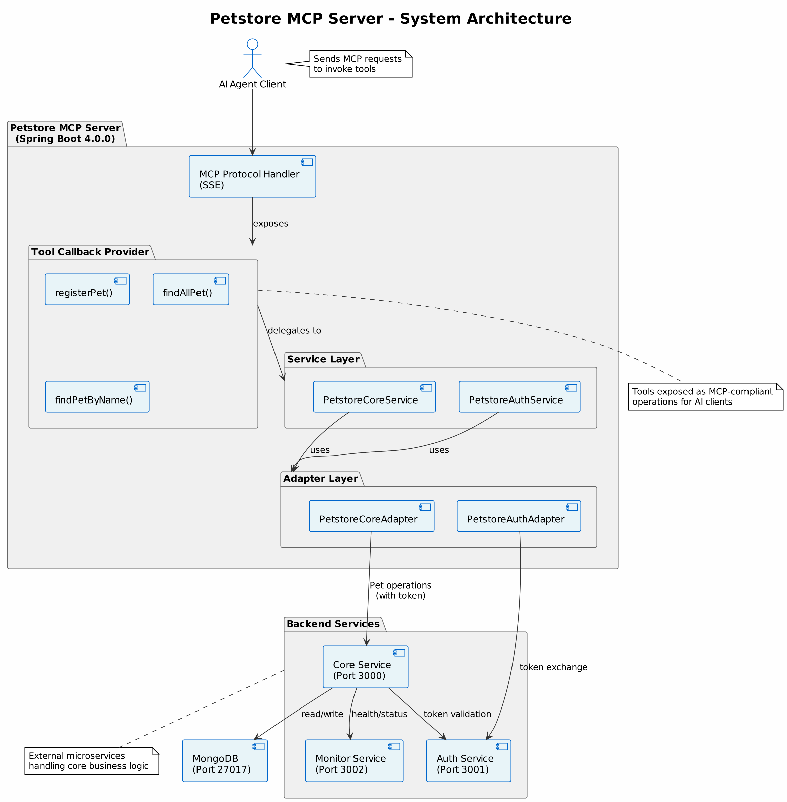

# Petstore MCP Server

<div align="center">

[](https://spring.io/projects/spring-boot)
[](https://www.oracle.com/java/)
[](https://www.docker.com/)
[]()

A Spring Boot application that demonstrates **Model Context Protocol (MCP) server** implementation with real-world pet store management capabilities. This project builds a MCP Server on top of backend created by [this repo](https://github.com/adautomendes/petstore-ref-project).

</div>

---

## Table of Contents

- [Overview](#overview)
- [Architecture](#architecture)
- [Features](#features)
- [Technology Stack](#technology-stack)
- [Prerequisites](#prerequisites)
- [Project Structure](#project-structure)
- [Getting Started](#getting-started)
  - [Local Development](#local-development)
  - [Docker Setup](#docker-setup)
  - [Configuration](#configuration)
- [API Documentation](#api-documentation)
  - [Tools (MCP Server Capabilities)](#tools-mcp-server-capabilities)
- [Development Guide](#development-guide)
  - [Building the Project](#building-the-project)
  - [Running Tests](#running-tests)
  - [Code Structure](#code-structure)
- [Data Population](#data-population)
- [Environment Variables](#environment-variables)
- [Troubleshooting](#troubleshooting)
- [Contributing](#contributing)
- [License](#license)

---

## Overview

The **Petstore MCP Server** is a sophisticated Spring Boot application that implements the Model Context Protocol (MCP) server specification. It serves as a bridge between AI clients and the petstore system, exposing core petstore operations as MCP-compliant tools that AI agents can invoke.

### Key Highlights

- ✨ **MCP Server Implementation** - Follows the Model Context Protocol specification for AI-ready tool exposure
- 🔐 **Authentication Integration** - Seamless integration with the petstore authentication service
- 📦 **RESTful Communication** - WebClient-based communication with backend services
- 🐳 **Containerized** - Docker and Docker Compose support for easy deployment
- 🔧 **Spring AI Framework** - Leverages Spring AI for advanced tool management and callback mechanisms
- 🌐 **Service Mesh Ready** - Configured with health checks and networking for production deployments

---

## Architecture



---

## Features

### Core Capabilities

| Feature | Description |
|---------|-------------|
| **Pet Registration** | Register new pets in the petstore system with name, breed, and age |
| **Pet Lookup** | Search for pets by name or retrieve all registered pets |
| **Authentication** | Integrated authentication with token-based access |
| **MCP Protocol** | Server-Sent Events (SSE) based communication protocol |
| **Tool Exposure** | All operations exposed as MCP-compliant tools for AI clients |

### Non-Functional Features

- 🏥 **Health Checks** - Container health monitoring
- 📊 **Service Discovery** - Docker Compose networking for service-to-service communication
- 🔄 **Dependency Management** - Proper service startup ordering with health checks
- 🛡️ **Error Handling** - Comprehensive error handling and propagation
- 📈 **Scalability** - Stateless design for horizontal scaling

---

## Technology Stack

### Core Technologies

| Component | Version | Purpose |
|-----------|---------|---------|
| **Java** | 21 | Programming language |
| **Spring Boot** | 4.0.0 | Application framework |
| **Spring AI** | 2.0.0-SNAPSHOT | MCP server and tool management |
| **Spring WebFlux** | Latest | Reactive web framework |
| **Maven** | 3.9.6 | Build and dependency management |

### Dependencies

```xml
- spring-ai-starter-mcp-server-webmvc   : MCP Server implementation
- spring-boot-starter-webflux           : Reactive HTTP client/server
- lombok                                : Boilerplate reduction
```

### Infrastructure

| Component | Role |
|-----------|------|
| **Docker** | Containerization |
| **Docker Compose** | Service orchestration |
| **MongoDB** | Data persistence (via petstore-core) |

---

## Prerequisites

### System Requirements

- **Java 21+** - JDK for compilation and execution
- **Maven 3.9+** - Build tool
- **Docker & Docker Compose** - For containerized deployment
- **Git** - Version control
- **4GB RAM minimum** - For running the complete stack

### Development Tools

- IntelliJ IDEA or VS Code with Java extensions
- Terminal/Command Prompt
- Git client

---

## Getting Started

### Local Development

#### 1. Clone the Repository

```bash
git clone <repository-url>
cd petstore-mcp-server
```

#### 2. Prerequisites Check

```bash
# Verify Java installation
java -version  # Should be 21+

# Verify Maven installation
mvn -version
```

#### 3. Build the Application

```bash
cd java
mvn clean package -DskipTests
```

#### 4. Run Locally

```bash
# From the java directory
mvn spring-boot:run \
  -Dspring-boot.run.arguments="--server.port=8082 --petstore-auth.host=localhost --petstore-core.host=localhost"
```

The server will start on `http://localhost:8082`

---

### Docker Setup

#### 1. Using Docker Compose (Recommended)

Start all services with one command:

```bash
cd /path/to/petstore-mcp-server
docker compose up -d
```

The Docker Compose setup will:
- Build the MCP Server from source (Dockerfile at [docker/Dockerfile](docker/Dockerfile))
- Use pre-built images from Docker Hub for dependent services
- Create a network for service-to-service communication
- Set up health checks for all services

Services will be available at:
- **Petstore MCP Server**: http://localhost:8082
- **Petstore Core API**: http://localhost:3000
- **Petstore Auth**: http://localhost:3001
- **Petstore Monitor**: http://localhost:3002
- **MongoDB**: localhost:27017

#### 2. Verify Services

```bash
# Check all containers are running
docker compose ps

# View logs
docker compose logs -f petstore-mcp-server

# Check service health
curl http://localhost:8082/actuator/health
```

#### 3. Stop Services

```bash
docker compose down
```

To remove volumes as well:

```bash
docker compose down -v
```

---

### Configuration

#### Environment Variables

Key configuration through environment variables:

```bash
# MCP Server Configuration
SERVER_PORT=8082                          # Server port
PETSTORE_AUTH_HOST=petstore-auth         # Auth service hostname
PETSTORE_AUTH_PORT=3001                  # Auth service port
PETSTORE_CORE_HOST=petstore-core         # Core service hostname
PETSTORE_CORE_PORT=3000                  # Core service port
```

#### Application Properties

Configuration file: [application.properties](java/src/main/resources/application.properties)

```properties
server.port=${SERVER_PORT:8082}
spring.ai.mcp.server.name=petstore-mcp-server
spring.ai.mcp.server.version=0.0.1
spring.ai.mcp.server.protocol=SSE
```

#### Setting Configuration

For local development, create `java/src/main/resources/application-local.properties`:

```properties
server.port=8082
petstore-auth.host=localhost
petstore-auth.port=3001
petstore-core.host=localhost
petstore-core.port=3000
```

---

## API Documentation

### Tools (MCP Server Capabilities)

The MCP Server exposes the following tools that AI clients can invoke:

#### 1. Register a New Pet

**Tool Name:** `registerPet`

Registers a new pet in the petstore system.

**Parameters:**

| Parameter | Type | Required | Description |
|-----------|------|----------|-------------|
| `nome` | String | Yes | The pet's name |
| `breed` | String | Yes | The pet's breed |
| `age` | Integer | Yes | The pet's age in years |

**Response:**

```json
{
  "id": "507f1f77bcf86cd799439011",
  "name": "Bella",
  "breed": "Labrador",
  "age": 5
}
```

**Example Usage:**

```python
# AI client example
tool_use = {
    "name": "registerPet",
    "input": {
        "nome": "Buddy",
        "breed": "Golden Retriever",
        "age": 3
    }
}
```

---

#### 2. Get All Pets

**Tool Name:** `findAllPet`

Returns a list of all registered pets in the system.

**Parameters:** None

**Response:**

```json
[
  {
    "id": "507f1f77bcf86cd799439011",
    "name": "Bella",
    "breed": "Labrador",
    "age": 5
  },
  {
    "id": "507f1f77bcf86cd799439012",
    "name": "Max",
    "breed": "German Shepherd",
    "age": 3
  }
]
```

**Example Usage:**

```python
# AI client example
tool_use = {
    "name": "findAllPet",
    "input": {}
}
```

---

#### 3. Find Pets by Name

**Tool Name:** `findPetByName`

Returns a list of pets matching the provided name.

**Parameters:**

| Parameter | Type | Required | Description |
|-----------|------|----------|-------------|
| `name` | String | Yes | The name of the pet to search for |

**Response:**

```json
[
  {
    "id": "507f1f77bcf86cd799439011",
    "name": "Bella",
    "breed": "Labrador",
    "age": 5
  }
]
```

**Example Usage:**

```python
# AI client example
tool_use = {
    "name": "findPetByName",
    "input": {
        "name": "Bella"
    }
}
```

---

### MCP Server Metadata

```json
{
  "protocolVersion": "2024-11-05",
  "capabilities": {},
  "info": {
    "name": "petstore-mcp-server",
    "version": "0.0.1"
  },
  "tools": [
    {
      "name": "registerPet",
      "description": "Register a new pet",
      "inputSchema": {
        "type": "object",
        "properties": {
          "nome": {"type": "string", "description": "The pet name"},
          "breed": {"type": "string", "description": "The pet breed"},
          "age": {"type": "integer", "description": "The pet age"}
        },
        "required": ["nome", "breed", "age"]
      }
    },
    {
      "name": "findAllPet",
      "description": "Returns a list with all registered pets"
    },
    {
      "name": "findPetByName",
      "description": "Returns a list with registered pets with a given name",
      "inputSchema": {
        "type": "object",
        "properties": {
          "name": {"type": "string", "description": "The name of pet to be found"}
        },
        "required": ["name"]
      }
    }
  ]
}
```

---

## Development Guide

### Building the Project

#### Clean Build

```bash
cd java
mvn clean install
```

#### Skip Tests

```bash
mvn clean package -DskipTests
```

#### Build with Specific Profile

```bash
mvn clean package -P production
```

#### View Dependencies

```bash
mvn dependency:tree
```

---

### Running Tests

#### Run All Tests

```bash
cd java
mvn test
```

#### Run Specific Test Class

```bash
mvn test -Dtest=PetstoreCoreServiceTest
```

#### Run with Coverage

```bash
mvn test jacoco:report
# Report available at: target/site/jacoco/index.html
```

---

### Code Structure

#### Service Layer

**[PetstoreCoreService.java](java/src/main/java/com/adauto/mediamanager/mcp/server/service/PetstoreCoreService.java)**

Core business logic that exposes MCP tools:

```java
@Service
public class PetstoreCoreService {
    @Tool(description = "Register a new pet")
    public PetDTO registerPet(
        @ToolParam(description = "The pet name") String nome,
        @ToolParam(description = "The pet breed") String breed,
        @ToolParam(description = "The pet age") Integer age)
    
    @Tool(description = "Returns a list with all registered pets")
    public List<PetDTO> findAllPet()
    
    @Tool(description = "Returns a list with registered pets with a given name")
    public List<PetDTO> findPetByName(
        @ToolParam(description = "The name of pet to be found") String name)
}
```

**[PetstoreAuthService.java](java/src/main/java/com/adauto/mediamanager/mcp/server/service/PetstoreAuthService.java)**

Handles authentication and token management:

```java
@Service
public class PetstoreAuthService {
    public String getToken() // Returns auth token for API calls
}
```

#### Adapter Layer

**[PetstoreCoreAdapter.java](java/src/main/java/com/adauto/mediamanager/mcp/server/adapter/PetstoreCoreAdapter.java)**

Provides WebClient for core service communication:

```java
@Component
public class PetstoreCoreAdapter {
    public WebClient getPetstoreCoreWebClient()
}
```

**[PetstoreAuthAdapter.java](java/src/main/java/com/adauto/mediamanager/mcp/server/adapter/PetstoreAuthAdapter.java)**

Provides WebClient for authentication service communication:

```java
@Component
public class PetstoreAuthAdapter {
    public WebClient getPetstoreAuthWebClient()
}
```

#### Model Layer

**[PetDTO.java](java/src/main/java/com/adauto/mediamanager/mcp/server/model/dto/PetDTO.java)**

Data transfer object for pet information with fields: `id`, `name`, `breed`, `age`.

**[LoginRequestDTO.java](java/src/main/java/com/adauto/mediamanager/mcp/server/model/dto/LoginRequestDTO.java)**

Request model for authentication.

**[LoginResponseDTO.java](java/src/main/java/com/adauto/mediamanager/mcp/server/model/dto/LoginResponseDTO.java)**

Response model containing authentication token.

---

### Adding a New Tool

To add a new tool to the MCP server:

1. **Add method to [PetstoreCoreService.java](java/src/main/java/com/adauto/mediamanager/mcp/server/service/PetstoreCoreService.java):**

```java
@Tool(description = "Your tool description")
public YourReturnType yourToolMethod(
    @ToolParam(description = "Parameter description") String param1,
    @ToolParam(description = "Parameter description") String param2)
{
    // Implementation logic
    // Make WebClient calls to petstore-core via petstoreCoreAdapter
    return result;
}
```

2. **Rebuild and deploy:**

```bash
cd java
mvn clean package
```

3. **If using Docker:**

```bash
docker compose up -d --build
```

The tool will automatically be registered with the MCP server and exposed to AI clients.

---

## Data Population

### Using the Population Script

The project includes a Python script to populate test data:

```bash
cd populator
pip install requests
python populate-petstore.py --host http://localhost:3000 --count 10
```

### Script Features

- Generates random pet names and breeds
- Creates realistic pet data
- Supports batch operations
- Error handling and retries

### Arguments

| Argument | Default | Description |
|----------|---------|-------------|
| `--host` | http://localhost:3000 | Petstore core service URL |
| `--count` | 5 | Number of pets to generate |
| `--seed` | Random | Random seed for reproducibility |

---

## Environment Variables

### MCP Server Variables

```bash
# Server configuration
SERVER_PORT=8082

# Petstore Auth Service
PETSTORE_AUTH_HOST=petstore-auth
PETSTORE_AUTH_PORT=3001

# Petstore Core Service
PETSTORE_CORE_HOST=petstore-core
PETSTORE_CORE_PORT=3000
```

### Docker Compose Variables

Set in `docker-compose.yaml` or via `.env` file:

```bash
# Copy to .env file in project root
SERVER_PORT=8082
PETSTORE_AUTH_HOST=petstore-auth
PETSTORE_AUTH_PORT=3001
PETSTORE_CORE_HOST=petstore-core
PETSTORE_CORE_PORT=3000
```

---

## Troubleshooting

### Common Issues

#### 1. Connection Refused to Auth Service

**Symptom:** `java.net.ConnectException: Connection refused`

**Solution:**

```bash
# Verify auth service is running
curl http://localhost:3001/

# Check Docker containers
docker compose ps

# View auth service logs
docker compose logs petstore-auth
```

#### 2. MongoDB Connection Error

**Symptom:** `com.mongodb.MongoServerSelectionException`

**Solution:**

```bash
# Verify MongoDB is running
curl http://localhost:27017/

# Restart MongoDB
docker compose restart petstore-mongo

# Check MongoDB logs
docker compose logs petstore-mongo
```

#### 3. Port Already in Use

**Symptom:** `Address already in use`

**Solution:**

```bash
# Find process using port 8082
lsof -i :8082
# or on Windows
netstat -ano | findstr :8082

# Kill the process or use different port
export SERVER_PORT=8083
docker-compose up -d
```

#### 4. Build Failure - Maven Dependency

**Symptom:** `ERROR Failed to execute goal on project`

**Solution:**

```bash
# Clear Maven cache
rm -rf ~/.m2/repository

# Rebuild with offline download
cd java
mvn dependency:go-offline
mvn clean package
```

#### 5. Spring AI Snapshot Issues

**Symptom:** `Cannot find artifact org.springframework.ai:spring-ai-*`

**Solution:**

```bash
# Update POM to use milestone release instead of snapshot
# Or ensure repositories are configured in pom.xml
mvn clean package -U  # -U forces update of snapshots
```

### Debugging

#### Enable Debug Logging

Set in `application.properties`:

```properties
logging.level.com.adauto=DEBUG
logging.level.org.springframework.ai=DEBUG
```

#### Check MCP Server Status

```bash
# Health endpoint
curl http://localhost:8082/actuator/health

# Server info
curl http://localhost:8082/actuator/info
```

#### View Server Logs

```bash
# Docker logs
docker compose logs -f petstore-mcp-server

# Real-time monitoring
docker compose logs --tail=50 -f petstore-mcp-server
```

---

## Contributing

### Development Workflow

1. **Create a feature branch:**
   ```bash
   git checkout -b feature/your-feature-name
   ```

2. **Make your changes:**
   - Follow existing code style
   - Add unit tests for new features
   - Update documentation

3. **Build and test:**
   ```bash
   cd java
   mvn clean verify
   ```

4. **Commit and push:**
   ```bash
   git add .
   git commit -m "feat: description of changes"
   git push origin feature/your-feature-name
   ```

5. **Create a Pull Request**

### Code Style

- Follow Google Java Style Guide
- Use meaningful variable names
- Add JavaDoc comments for public methods
- Keep methods focused and small

### Testing Requirements

- Unit tests for service layer
- Integration tests for adapters
- Minimum 80% code coverage
- Mock external dependencies

---

## Support & Documentation

- **Spring Boot Documentation**: https://spring.io/projects/spring-boot
- **Spring AI Documentation**: https://spring.io/projects/spring-ai
- **Model Context Protocol**: https://modelcontextprotocol.io/
- **Docker Documentation**: https://docs.docker.com/